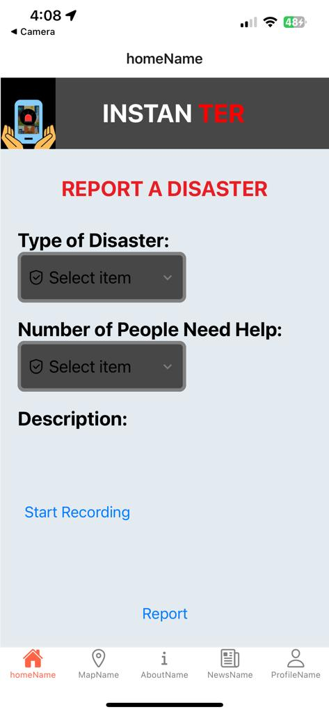

# Instanter - Natural Disaster Management System

Natural calamities and disasters may occur unannounced, but when they occur, they cause great loss to human life and property. During that period, each second is extremely crucial. Immediate action must be taken to avoid damage. People can call for help but the communication of sufficient information is not guaranteed.  During critical times of disaster, we need to quickly identify the areas of high impact, the number of affected people and what help they need. 

Instanter provides an end-to-end solution to provide information and resources to people who are affected by natural disasters.
It takes input like type of disaster, number of people affected, and voice message description, then sends it to NDRF for optimized resource allocation. This will help NDRF to handle such situations more effectively and make life easier for victims.

## Table of Contents
- [Table of Contents](#table-of-contents)
- [Installation](#installation)
- [How to use the app](#how-to-use-the-app)
- [Pages](#pages)
- [Tech Stack](#tech-stack)
- [Screenshots](#screenshots)

## Installation
* Clone the repository.
* Install dependencies by running npm install.
* Start the development server by running expo start.

## How to use the app

* The user can signup/login by entering their mobile number. An OTP will be generated and sent to the registered mobile number using which they can login 
* After successful authentication, the user will be redirected to the home page (report page). 

## Pages

* Register/Login page: Log into your account using your mobile number
* Report Page: In this page, the user has to enter the type of disaster, number of people  affected, and voice message description and report the disaster
* Location Page: This page displays a map showing the live location of the user and the NDRF admin offices
* Newsletter page: Displays the current temperature, weather alerts, recent earthquakes and local natural disaster based news
* Profile Page: Display the name, mobile number and location of the user
* Help page: Guides users on how to use the app

## Tech Stack

* Frontend  : React Native
* Backend : Flask
* Database : Google Firebase
* UI Designing : Canva

## Screenshots

 

